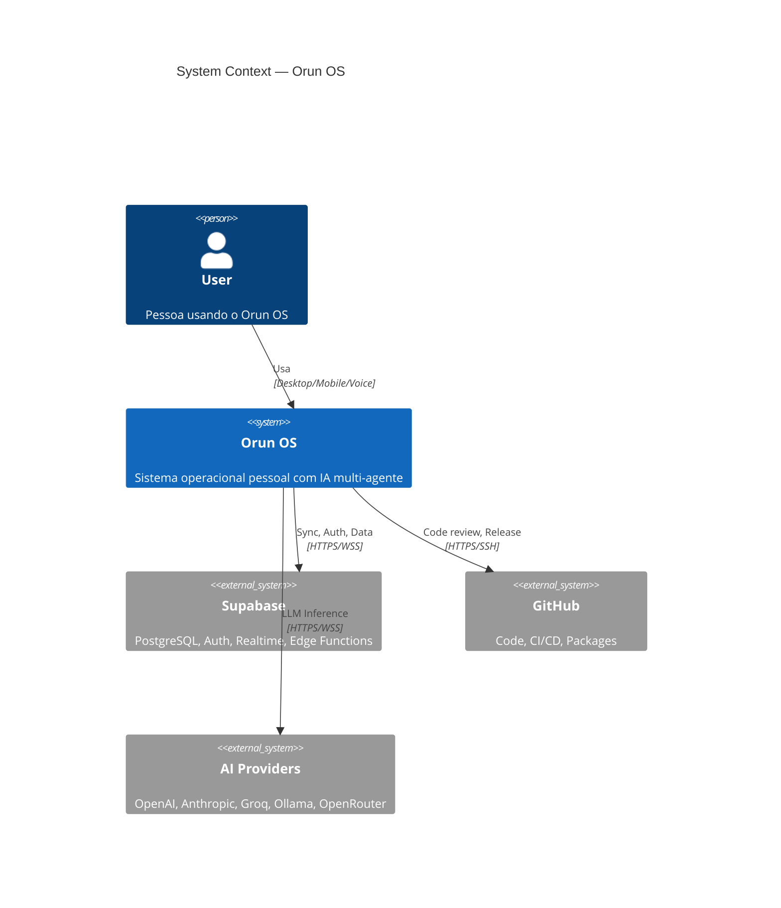
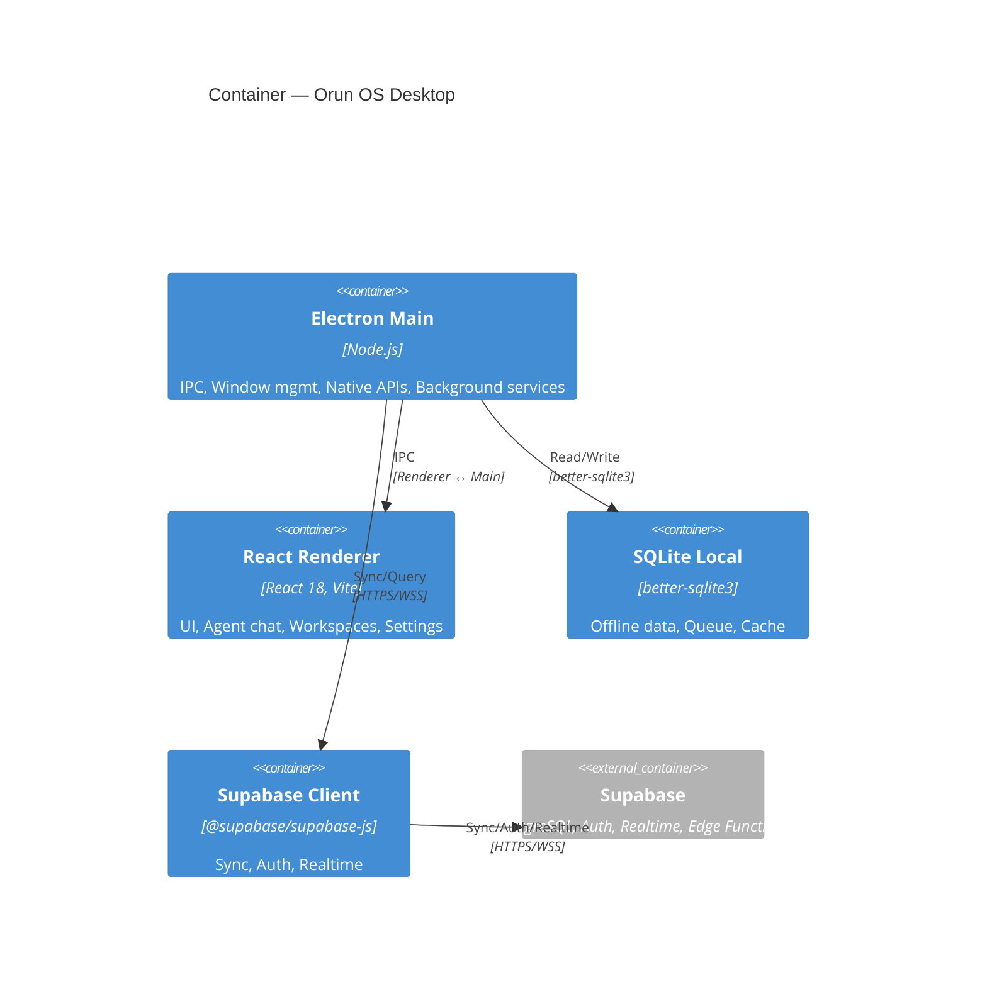
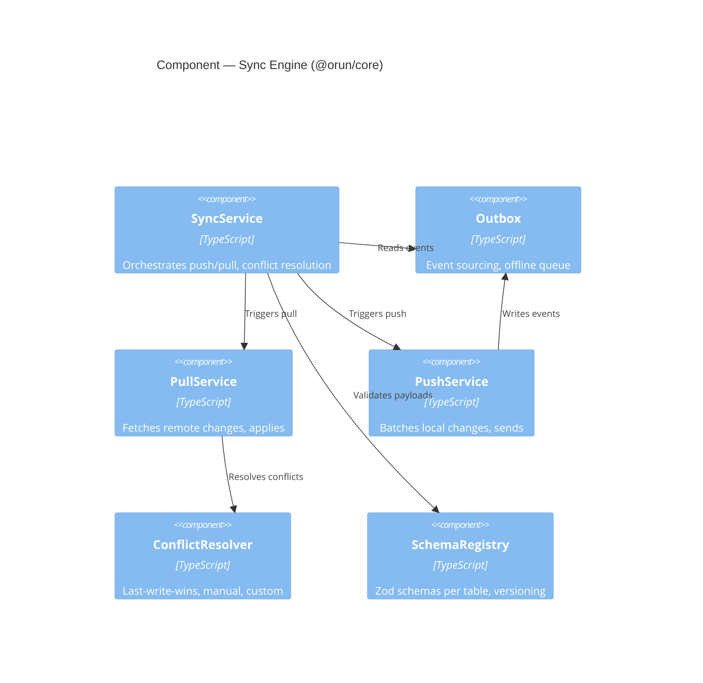

# Architecture Design Skill

## When to Use

Use this skill for:
- New @orun/* package proposals
- Cross-package integration designs
- Major refactors / rewrites
- API contract definitions (REST, gRPC, GraphQL, IPC)
- Data model changes (Supabase migrations, SQLite sync)
- Infrastructure decisions (Supabase, Edge Functions, Electron, Expo)
- ADR (Architecture Decision Records) creation
- C4 diagram generation (Context, Container, Component, Code)

## Architecture Principles (Orun)

### Core Tenets
1. **Local-first, sync-optional** — Works offline, syncs when online
2. **Package autonomy** — Each @orun/* independently versioned, testable, deployable
3. **Shared kernel** — `@orun/core` is the only required dependency
4. **Explicit contracts** — Zod schemas for all boundaries (API, IPC, DB, Events)
5. **Observability by default** — Logs, metrics, traces built-in
6. **Security at boundaries** — Validate, sanitize, authorize at every seam

### Technology Decisions (Current)

| Layer | Choice | Rationale |
|-------|--------|-----------|
| **Language** | TypeScript (strict) | Type safety across packages |
| **Runtime (Desktop)** | Electron 31 + Node 22 | Native access, Web APIs |
| **Runtime (Mobile)** | Expo SDK 51 + React Native 0.76 | Cross-platform, OTA updates |
| **Runtime (Edge)** | Deno (Supabase Edge Functions) | Secure, typed, fast cold start |
| **Database** | PostgreSQL (Supabase) + SQLite (local) | ACID + offline sync |
| **Sync Engine** | Custom (SQLite ↔ Supabase) | Conflict resolution, offline-first |
| **Real-time** | Supabase Realtime (Postgres Changes) | WebSocket, row-level security |
| **Auth** | @orun/identity (OAuth, MFA, Stripe) | Centralized, multi-tenant ready |
| **UI (Desktop)** | React 18 + Tailwind 4 + Radix | Modern, accessible, performant |
| **UI (Mobile)** | React Native + NativeWind + Expo Router | Shared design tokens |
| **Build** | Vite 6 + tsup + electron-builder | Fast, optimized bundles |
| **Test** | Vitest + Playwright + Testing Library | Unit, integration, e2e |
| **Lint/Format** | ESLint 9 + Prettier + TypeScript ESLint | Consistent, catch bugs early |

## Architecture Artifacts

### 1. ADR Template (Architecture Decision Record)

```markdown
# ADR-XXXX: [Short Title]

**Status:** Proposed | Accepted | Superseded | Deprecated
**Date:** YYYY-MM-DD
**Deciders:** [@github-handles]
**Consulted:** [@github-handles]
**Informed:** [@github-handles]

## Context
What problem are we solving? What constraints exist?

## Decision
What are we doing? Be specific.

## Consequences

### Positive
- Benefit 1
- Benefit 2

### Negative
- Trade-off 1 (mitigation: ...)
- Trade-off 2 (mitigation: ...)

### Neutral
- Observation

## Alternatives Considered
1. Alternative A — Rejected because...
2. Alternative B — Rejected because...

## Implementation Plan
- [ ] Step 1
- [ ] Step 2

## References
- Link to discussion, specs, related ADRs
```

### 2. C4 Diagram Templates

#### Context Diagram (Level 1)


#### Container Diagram (Level 2)


#### Component Diagram (Level 3) — Example: Sync Engine


### 3. API Contract (Zod Schema)

```typescript
// @orun/core/contracts/agent.ts
export const AgentCommandSchema = z.object({
  type: z.literal("agent.command"),
  payload: z.object({
    agentId: z.string().uuid(),
    action: z.enum(["trigger", "delegate", "query", "memory_save", "memory_search"]),
    params: z.record(z.unknown()),
    correlationId: z.string().uuid(),
  }),
  meta: z.object({
    timestamp: z.string().datetime(),
    source: z.enum(["user", "agent", "system", "webhook"]),
    userId: z.string().uuid().optional(),
  }),
});

export type AgentCommand = z.infer<typeof AgentCommandSchema>;
```

### 4. Data Model (Supabase + SQLite)

```sql
-- Core tables (shared via @orun/core migrations)
CREATE TABLE agents (
  id UUID PRIMARY KEY DEFAULT gen_random_uuid(),
  name TEXT NOT NULL,
  persona_prompt TEXT NOT NULL,
  skills TEXT[] DEFAULT '{}',
  model_tier TEXT CHECK (model_tier IN ('fast', 'powerful')),
  created_at TIMESTAMPTZ DEFAULT now(),
  updated_at TIMESTAMPTZ DEFAULT now()
);

CREATE TABLE conversations (
  id UUID PRIMARY KEY DEFAULT gen_random_uuid(),
  user_id UUID REFERENCES auth.users(id),
  agent_id UUID REFERENCES agents(id),
  title TEXT,
  metadata JSONB DEFAULT '{}',
  created_at TIMESTAMPTZ DEFAULT now(),
  updated_at TIMESTAMPTZ DEFAULT now()
);

CREATE TABLE messages (
  id UUID PRIMARY KEY DEFAULT gen_random_uuid(),
  conversation_id UUID REFERENCES conversations(id),
  role TEXT CHECK (role IN ('user', 'assistant', 'system', 'tool')),
  content TEXT NOT NULL,
  tool_calls JSONB,
  tool_results JSONB,
  tokens_used INTEGER,
  model TEXT,
  created_at TIMESTAMPTZ DEFAULT now()
);

-- Sync metadata (SQLite only)
CREATE TABLE _sync_metadata (
  table_name TEXT PRIMARY KEY,
  last_pulled_at TIMESTAMPTZ,
  last_pushed_at TIMESTAMPTZ,
  version INTEGER DEFAULT 1
);
```

## Design Review Checklist

### For New Package Proposal
- [ ] ADR written with context, decision, consequences
- [ ] C4 Context + Container diagrams
- [ ] Zod contracts for all public APIs
- [ ] Migration plan (if DB changes)
- [ ] Breaking change analysis (semver impact)
- [ ] Test strategy (unit, integration, contract)
- [ ] Documentation plan (README, API docs, examples)
- [ ] Release process (versioning, changelog, publishing)
- [ ] Dependencies justified (no duplicate functionality)

### For Cross-Package Integration
- [ ] Interface defined in shared package or `@orun/core`
- [ ] Consumer-driven contracts (Pact or Zod-based)
- [ ] Version compatibility matrix documented
- [ ] Migration path for existing consumers
- [ ] Rollback plan

### For Infrastructure Changes
- [ ] Cost analysis (current vs projected)
- [ ] Performance benchmarks (baseline + target)
- [ ] Security review (threat model, attack surface)
- [ ] Disaster recovery / rollback tested
- [ ] Monitoring/alerting updated

## Output Format (Architecture Proposal)

```json
{
  "proposalId": "arch-2026-001",
  "title": "Introduce @orun/terminal package",
  "status": "proposed",
  "adr": "markdown content...",
  "diagrams": {
    "context": "mermaid...",
    "container": "mermaid...",
    "component": "mermaid..."
  },
  "contracts": [
    { "name": "TerminalCommand", "schema": "zod schema..." },
    { "name": "TerminalOutput", "schema": "zod schema..." }
  ],
  "dataModel": "sql migrations...",
  "tradeoffs": [
    { "aspect": "bundle size", "decision": "lazy-load PTY", "impact": "+50KB initial" },
    { "aspect": "security", "decision": "sandbox PTY process", "impact": "added complexity" }
  ],
  "implementationPlan": [
    { "phase": 1, "tasks": ["ADR approval", "scaffold package", "contract tests"] },
    { "phase": 2, "tasks": ["PTY integration", "Electron IPC", "React UI"] },
    { "phase": 3, "tasks": ["Mobile (Expo) parity", "docs", "release"] }
  ],
  "reviewers": ["@head-devrel", "@vp-tech", "@hampton"],
  "estimatedEffort": "3 weeks",
  "targetDate": "2026-10-15"
}
```

## Handoff

**To:** Head of DevRel (code review), Cloud Architect (infra), Security Audit (threat model)
**From:** VP Tech (approval), Hampton (strategic alignment)
**Consumers:** All @orun/* package maintainers